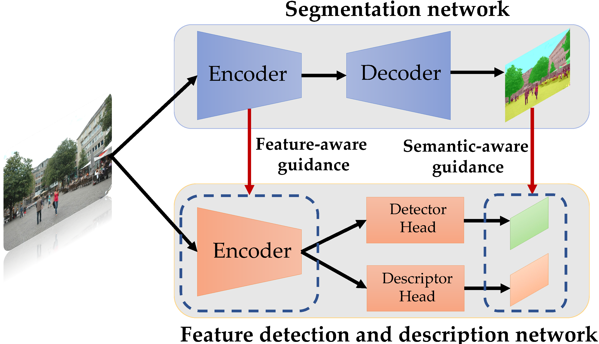

# SFD2: Semantic-guided Feature Detection and Description

<p align="center">
  
</p>

In this work, we propose to leverage global instances, which are robust to illumination and season changes for both
coarse and fine localization. For coarse localization, instead of performing global reference search directly, we search
for reference images from recognized global instances progressively. The recognized instances are further utilized for
instance-wise feature detection and matching to enhance the localization accuracy.

* Full paper PDF: [SFD2: Semantic-guided Feature Detection and Description](https://arxiv.org/abs/1911.11763).

* Authors: *Fei Xue, Ignas Budvytis, Roberto Cipolla*

* Website: [SFD2](https://github.com/feixue94/feixue94.github.io/lbr) for videos and slides.

## Dependencies

* Python 3 >= 3.6
* PyTorch >= 1.8
* OpenCV >= 3.4
* NumPy >= 1.18
* segmentation-models-pytorch = 0.1.3
* colmap
* pycolmap = 0.0.1

## Data preparation

- training data. We use the same training dataset as [R2D2](https://github.com/naver/r2d2). Please download the training dataset following the instructions provided by R2D2.
- segmentation model. [ConvXt](https://github.com/facebookresearch/ConvNeXt) is used to provide semantic labels and semantic-aware features for `stability` learning in the training process.
- local feature model. [SuperPoint](https://github.com/magicleap/SuperPointPretrainedNetwork) is used to provide local `reliability` in the training process. 

## Pretrained weights

Pretrained weights for SFD2 can be downloaded [here](https://drive.google.com/file/d/1N4j7PkZoy2CkWhS7u6dFzMIoai3ShG9p/view?usp=sharing). If you want to retrain the model, please also download the weights of [ConvXt](https://github.com/facebookresearch/ConvNeXt) and [SuperPoint](https://github.com/magicleap/SuperPointPretrainedNetwork) from [here](https://drive.google.com/file/d/1N4j7PkZoy2CkWhS7u6dFzMIoai3ShG9p/view?usp=sharing) and put them nto the `weights` directory.


## Localization results

Please download datasets e.g. Aachen_v1.1, RobotCar-Seasons v2, and Extended-CMU-Seasons from the [visualization benchmark](https://www.visuallocalization.net/) for evaluation.

* localization on Aachen_v1.1

```
./test_aachenv_1_1
```

you will get results like this:

| Day  | Night       | 
| ------- | -------- |
| 88.2 / 96.0 / 98.7 | 78.0 / 92.1 / 99.5 |

* localization on RobotCar-Seasons

```
./test_robotcar
```

you will get results like this:

|day | night  | night-rain       | 
| ----- | ------- | ------- | 
| 56.9 / 81.6 / 97.4 | 27.6 / 66.2 / 90.2 | 43.0 / 71.1 / 90.0 |

* localization on Extended CMU-Seasons
```
./test_ecmu
```
you will get results like this:

| urban  | suburban       |  park
| ----- | ------- | ------- |
| 95.0 / 97.5 / 98.6 |  90.5 / 92.7 / 95.3 | 86.4 / 89.1 / 91.2|
## Training

```
./train.sh
```

## BibTeX Citation

If you use any ideas from the paper or code from this repo, please consider citing:

```
@inproceedings{xue2023sfd2,
  author    = {Fei Xue and Ignas Budvytis and Roberto Cipolla},
  title     = {SFD2: Semantic-guided Feature Detection and Description},
  booktitle = {CVPR},
  year      = {2023}
}
```

## Acknowledgements

Part of the code is from previous excellent works
including [SuperPoint](https://github.com/magicleap/SuperPointPretrainedNetwork), [R2D2](https://github.com/naver/r2d2)
, [HLoc](https://github.com/cvg/Hierarchical-Localization), [ConvXt](https://github.com/facebookresearch/ConvNeXt), [LBR](https://github.com/feixue94/lbr). You can find more details from their released repositories
if you are interested in their works. 
